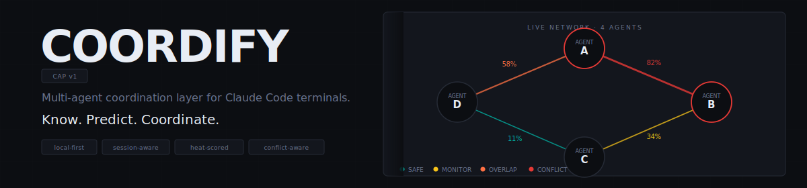
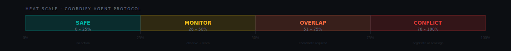
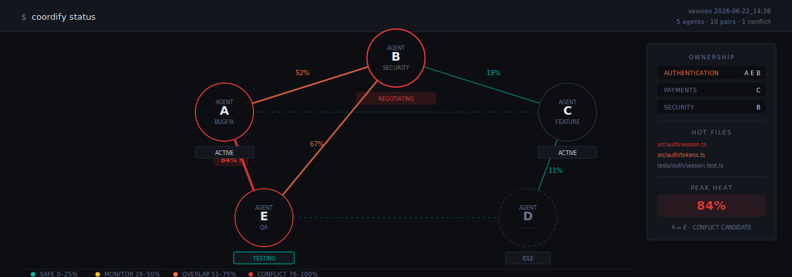
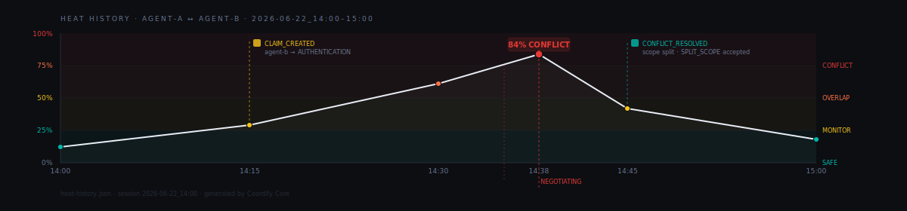

<div align="center">
  
</div>

<div align="center">

[](LICENSE)
[](https://claude.ai/code)
[]()
[]()
[](https://github.com/ch1kim0n1/coordify/releases)
[](https://github.com/ch1kim0n1/coordify/stargazers)

**Multi-agent coordination for Claude Code. Your agents. One codebase. No collisions.**

</div>

---

## The Problem

Open five terminals, run `claude` in the same repo, assign each one a task. Each agent understands the codebase. None of them understand each other.

One agent refactors a file while another patches it. One drifts silently from a bugfix into a broad refactor. Two block on each other without noticing the deadlock. Historical conflict patterns disappear between sessions.

Coordify fills that gap. It is not an orchestrator, not a master agent, not a cloud service. It is the missing coordination layer between independent terminal agents.

---

## How It Works

Every Claude Code session that opens inside a project root automatically joins a Coordify network. Agents claim ownership of tasks, domains, and files through the **Coordify Agent Protocol (CAP)**. Coordify Core validates those claims, calculates conflict risk, and surfaces coordination when it matters.

When the last terminal closes, the live network dies. Session artifacts and project intelligence persist.

### Ownership and Heat

Coordify tracks two things.

**Ownership** answers: who is responsible for what? Agents claim ownership explicitly before meaningful work. Claims have types, intents, domains, and estimated files. Co-ownership is allowed when scope differs.

**Heat** answers: how likely are two agents to collide? Heat is a deterministic pairwise score calculated by Coordify Core, not invented by an AI. It runs before coding starts (predicted heat) and updates continuously during execution (current heat).

<div align="center">
  
</div>

#### Heat Formula

```
Heat(A, B) =
  10% Task Similarity
+ 15% Intent Similarity
+ 15% Domain Overlap
+ 20% File / Path Overlap
+ 10% Temporal Activity Overlap
+ 10% Branch / Worktree Proximity
+ 10% Historical Hotzone Risk
+ 10% Historical Coupling
```

| Score | Band | Action |
|------:|------|--------|
| 0–25  | Safe | No action |
| 26–50 | Monitor | Added to context, no interruption |
| 51–75 | Overlap | Warning issued, coordination encouraged |
| 76–100 | Conflict Candidate | Structured conflict opened |

### Intent

Every claim carries an intent. Intent affects heat. Same file, different intent can be safe. Same file, same intent is much riskier.

Supported intents: `BUGFIX` `FEATURE` `REFACTOR` `SECURITY` `TESTING` `QA` `PERFORMANCE` `DOCUMENTATION` `ARCHITECTURE` `DEVOPS` `RESEARCH` `MIGRATION`

### Agent States

| State | Meaning |
|-------|---------|
| `DISCOVERY` | No clear task yet. No ownership claimed. |
| `IDLE` | Waiting for user input, nothing running. |
| `ACTIVE` | Has accepted task and is executing. |
| `SUBAGENT_WAITING` | Main agent waiting on active subagent. |
| `TESTING` | Running or evaluating tests. |
| `BLOCKED` | Cannot proceed due to conflict or dependency. |
| `NEGOTIATING` | Participating in conflict resolution. |
| `WAITING_USER` | Requires a human decision. |
| `OFFLINE` | Exited cleanly or disappeared. |

---

## Live Network

<div align="center">
  
</div>

Coordify networks are session-scoped. A network is born when the first Claude Code terminal opens in a project root. Additional terminals join the same network automatically. When the last terminal closes, the network dies. Live state is deleted. Session artifacts are finalized. Project intelligence persists.

### Pre-Task Heat Forecast

Before a claim is accepted, Coordify runs speculative predicted heat against active claims, domains, files, branches, hotzones, and the coupling graph.

```
Proposed task: Fix auth token expiry

Predicted heat with Agent B: 74% OVERLAP

Reasons:
- Agent B owns AUTHENTICATION
- src/auth/session.ts is a historical hotzone
- src/auth/session.ts is coupled with tests/auth/session.test.ts
- both agents are active on same branch

Recommendation:
Split scope now or sequence after Agent B.
```

This surfaces conflicts before they happen, not after.

### Conflict Resolution

When heat crosses a threshold, affected agents enter `NEGOTIATING`. Agents exchange structured CAP proposals. Compatible proposals apply automatically. Incompatible proposals escalate to the user. Every affected terminal shows the same decision prompt.

Supported resolution types: `CO_OWN` `SPLIT_SCOPE` `YIELD_CLAIM` `TRANSFER_TASK` `QUEUE_TASK` `ASK_USER` `ABORT_TASK`

Coordify also detects deadlocks (circular wait graphs) and escalates them directly to user arbitration.

---

## Session Intelligence

<div align="center">
  
</div>

Live state dies with the network. Project intelligence survives in `.coordify/knowledge/` and improves with each session.

| Knowledge File | What It Tracks |
|----------------|---------------|
| `hotzones.json` | Files and domains with historically high heat or conflicts |
| `coupling-graph.json` | Files that are behaviorally modified together across sessions |
| `velocity-profiles.json` | Per-agent timing: prompt to claim, claim to first write, blocked time |
| `coordination-overhead.json` | How much activity goes to coordination vs coding |

Coupling is behavioral, not static. It is derived from what agents actually touch together, not from import graphs.

---

## Install

```bash
npm install -g coordify
```

Coordify Core ships as a single Rust binary. The CLI and hook adapter are TypeScript. No configuration required to start.

---

## Quickstart

```bash
# Initialize in your project root
cd my-project
coordify init

# Open Claude Code terminals normally — Coordify handles the rest
claude   # terminal 1
claude   # terminal 2
claude   # terminal 3

# Check live status from any terminal
coordify status

# See heat between all agent pairs
coordify heat

# Full session stats
coordify stats
```

---

## CLI Reference

| Command | Description |
|---------|-------------|
| `coordify status` | Live network summary |
| `coordify agents` | All agents, states, and tasks |
| `coordify heat` | Pairwise heat scores |
| `coordify claims` | Active ownership claims |
| `coordify conflicts` | Open conflicts and resolution state |
| `coordify graph` | Dependency and coupling graph |
| `coordify watch` | Live TUI |
| `coordify logs` | Session log output |
| `coordify stats` | Engineering and resource metrics |
| `coordify session list` | All recorded sessions |
| `coordify session inspect` | Inspect a specific session |
| `coordify simulate` | Run a fixture without Claude Code |
| `coordify replay` | Replay a session event log |

---

## Configuration

Coordify ships with opinionated defaults. Override them in `coordify.yaml` at the project root.

```yaml
heat:
  safeMax: 25
  monitorMax: 50
  overlapMax: 75
  conflictMin: 76

claims:
  orphanTtlSeconds: 300
  lowConfidenceRejectBelow: 0.45
  provisionalBelow: 0.75

escalation:
  defaultMode: coordinate
  strictProtectedPaths:
    - "schema.prisma"
    - "src/auth/**"
    - "infra/**"

logging:
  traceLevel: verbose
  compressOnSessionEnd: true

knowledge:
  enabled: true
  hotzoneWeight: 0.10
  couplingWeight: 0.10
```

---

## Architecture

Coordify has four components.

| Component | Language | Role |
|-----------|----------|------|
| **Coordify Core** | Rust | Local runtime and source of truth |
| **Coordify Hooks** | TypeScript | Claude Code hook adapter |
| **Coordify CLI** | TypeScript | User-facing command surface |
| **Coordify TUI** | TypeScript | Optional live terminal UI |

Core is a single static binary. It owns canonical live state. It validates every CAP event before mutating state. It never calls an LLM to decide heat. Agents propose. Core commits.

Communication between hooks and Core runs over a Unix domain socket (macOS/Linux) or named pipe (Windows) with a session-scoped auth token.

### Project Layout

```
coordify/
  packages/
    coordify-core/       # Rust local runtime
    coordify-cli/        # TypeScript CLI wrapper
    coordify-hooks/      # Claude Code hook adapter
    coordify-schemas/    # JSON Schemas for CAP / config / storage
    coordify-tui/        # Terminal UI
    coordify-sim/        # Simulation runner

  fixtures/
    simple-conflict.json
    deadlock.json
    clear-reset.json
    orphaned-claim.json
```

### Storage Layout

```
.coordify/
  runtime/
    core.sock
    core.lock
    live-state.json
    heartbeat/

  sessions/
    2026-06-22_18-42-11/
      events.log
      diagnostics.log
      trace.log
      stats.json
      heat-history.json
      session-summary.json

  knowledge/
    hotzones.json
    coupling-graph.json
    velocity-profiles.json

  config/
    coordify.yaml
```

Runtime files are ephemeral. Sessions and knowledge persist.

### Crash Handling

If an agent exits without a clean shutdown, its claims become `ORPHANED` with a TTL instead of disappearing. Other agents can reclaim after TTL, or you can force release:

```bash
coordify claim release --orphaned
```

If Coordify Core crashes, agents do not silently pretend coordination is still active. Behavior depends on your configured escalation level, from warning-only up to blocking protected writes until Core recovers.

---

## Scope

**MVP** is Claude Code CLI, local machine, single project root, CLI/TUI only. No web dashboard. No cloud. No cross-machine networking.

**Post-MVP** includes Codex CLI support, open-source agent adapters, multi-machine networks, multi-repo coordination, and advanced dashboards.

---

## Contributing

CAP is testable without Claude Code. Use `coordify simulate` with any fixture file to run agent scenarios locally. See `fixtures/` for examples.

Before submitting a Core change, run the simulation suite:

```bash
coordify simulate fixtures/simple-conflict.json
coordify simulate fixtures/deadlock.json
coordify simulate fixtures/clear-reset.json
coordify simulate fixtures/orphaned-claim.json
```

---

## License

MIT
